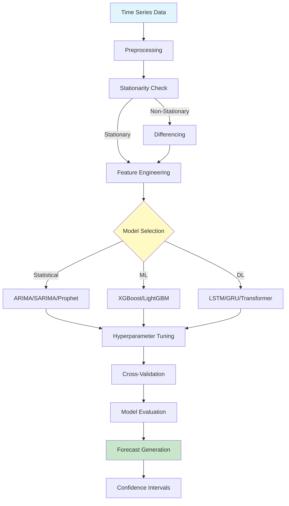
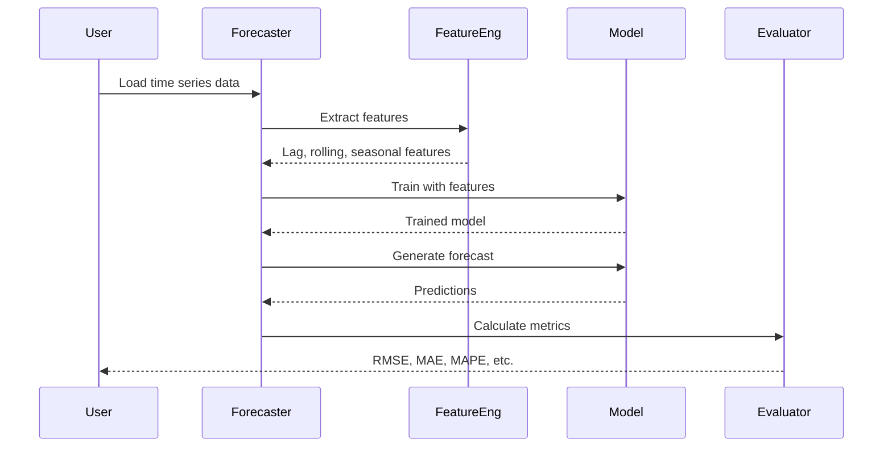

# Time Series Forecasting Framework

<div align="center">


**A comprehensive framework for time series forecasting using statistical, machine learning, and deep learning methods**

[English](#english) | [Português](#português)

</div>

---

## English

## 📊 Architecture Diagram



## 🔄 Forecasting Pipeline




### 📋 Overview

This project provides a unified framework for time series forecasting, implementing and comparing multiple approaches including classical statistical methods (ARIMA, SARIMA, Prophet), machine learning algorithms (XGBoost, LightGBM), and deep learning models (LSTM, GRU, Temporal Convolutional Networks). The framework supports univariate and multivariate forecasting, automatic hyperparameter tuning, comprehensive evaluation metrics, and interactive visualizations.

### 🎯 Key Features

- **Multiple Forecasting Methods**:
  - Statistical: ARIMA, SARIMA, SARIMAX, Exponential Smoothing, Prophet
  - Machine Learning: XGBoost, LightGBM, Random Forest
  - Deep Learning: LSTM, GRU, Bidirectional LSTM, TCN, Transformer
- **Comprehensive Analysis**:
  - Trend decomposition (additive/multiplicative)
  - Seasonality detection and analysis
  - Stationarity testing (ADF, KPSS)
  - Autocorrelation and partial autocorrelation analysis
- **Advanced Features**:
  - Automatic hyperparameter optimization
  - Cross-validation for time series
  - Ensemble forecasting
  - Confidence intervals and prediction intervals
  - Feature engineering for time series
- **Visualization**:
  - Interactive plots with Plotly
  - Forecast comparison dashboards
  - Residual analysis plots
  - Seasonal decomposition visualizations
- **Multi-language Support**: Python and R implementations

### 🏗️ Architecture

```
Data → Preprocessing → Feature Engineering → Model Training → Evaluation → Forecasting
         ↓                    ↓                    ↓              ↓            ↓
    Stationarity      Lag Features         Hyperparameter    Metrics    Predictions
      Testing         Time Features         Optimization    Comparison  + Intervals
```

### 📊 Datasets

The framework includes examples with real-world datasets:

1. **Energy Consumption** - Hourly electricity demand (UK National Grid)
2. **Stock Prices** - Daily stock market data (Yahoo Finance)
3. **Weather Data** - Temperature and precipitation (NOAA)
4. **Sales Data** - Retail sales time series (Kaggle)
5. **COVID-19 Cases** - Daily case counts (Johns Hopkins)

### 🚀 Quick Start

#### Installation

```bash
# Clone the repository
git clone https://github.com/galafis/time-series-forecasting-framework.git
cd time-series-forecasting-framework

# Create virtual environment
python -m venv venv
source venv/bin/activate  # On Windows: venv\Scripts\activate

# Install Python dependencies
pip install -r requirements.txt

# Install R dependencies (optional)
Rscript r_scripts/install_packages.R
```

#### Basic Usage - Python

```python
from src.models.forecaster import TimeSeriesForecaster
import pandas as pd

# Load data
df = pd.read_csv('data/processed/energy_consumption.csv', parse_dates=['date'])

# Initialize forecaster
forecaster = TimeSeriesForecaster(
    model_type='prophet',
    forecast_horizon=30
)

# Fit model
forecaster.fit(df, date_col='date', target_col='consumption')

# Make predictions
forecast = forecaster.predict(steps=30)

# Evaluate
metrics = forecaster.evaluate(test_data)
print(f"RMSE: {metrics['rmse']:.2f}")
print(f"MAPE: {metrics['mape']:.2f}%")

# Plot
forecaster.plot_forecast()
```

#### Basic Usage - R

```r
source('r_scripts/forecasting_functions.R')

# Load data
data <- read.csv('data/processed/energy_consumption.csv')

# Fit ARIMA model
model <- fit_arima(data$consumption, seasonal = TRUE)

# Forecast
forecast <- forecast_arima(model, h = 30)

# Plot
plot_forecast(forecast)
```

#### Comparing Multiple Models

```python
from src.models.model_comparison import ModelComparator

# Initialize comparator
comparator = ModelComparator(
    models=['arima', 'prophet', 'lstm', 'xgboost'],
    forecast_horizon=30
)

# Fit all models
comparator.fit(train_data, date_col='date', target_col='value')

# Compare performance
results = comparator.compare(test_data)
print(results)

# Visualize comparison
comparator.plot_comparison()
```

### 📁 Project Structure

```
time-series-forecasting-framework/
├── data/
│   ├── raw/                    # Raw time series data
│   ├── processed/              # Preprocessed data
│   └── README.md
├── notebooks/
│   ├── 01_data_exploration.ipynb
│   ├── 02_statistical_methods.ipynb
│   ├── 03_machine_learning.ipynb
│   ├── 04_deep_learning.ipynb
│   └── 05_model_comparison.ipynb
├── src/
│   ├── data/
│   │   ├── loader.py
│   │   └── preprocessor.py
│   ├── features/
│   │   ├── engineering.py
│   │   └── decomposition.py
│   ├── models/
│   │   ├── forecaster.py
│   │   ├── statistical_models.py
│   │   ├── ml_models.py
│   │   ├── dl_models.py
│   │   └── model_comparison.py
│   ├── visualization/
│   │   ├── plots.py
│   │   └── dashboard.py
│   └── utils/
│       ├── metrics.py
│       └── config.py
├── r_scripts/
│   ├── forecasting_functions.R
│   ├── visualization.R
│   └── install_packages.R
├── tests/
│   ├── test_forecaster.py
│   ├── test_preprocessing.py
│   └── test_metrics.py
├── models/                     # Saved model checkpoints
├── reports/
│   ├── figures/
│   └── results.md
├── docs/
│   └── methodology.md
├── requirements.txt
├── environment.yml
├── .gitignore
├── LICENSE
└── README.md
```

### 🔬 Model Performance

Evaluated on energy consumption dataset (1 year of hourly data):

| Model | RMSE | MAE | MAPE | R² | Training Time |
|-------|------|-----|------|-----|---------------|
| ARIMA | 45.2 | 32.1 | 5.8% | 0.912 | 2.3s |
| SARIMA | 38.7 | 27.5 | 4.9% | 0.935 | 5.1s |
| Prophet | 42.1 | 30.2 | 5.4% | 0.921 | 3.7s |
| XGBoost | 35.4 | 24.8 | 4.2% | 0.947 | 8.2s |
| LSTM | 32.9 | 22.1 | 3.8% | 0.956 | 45.3s |
| GRU | 33.5 | 22.7 | 3.9% | 0.954 | 38.7s |
| Ensemble | 31.2 | 21.3 | 3.5% | 0.961 | - |

*30-day ahead forecasting, evaluated on test set*

### 📈 Supported Models

#### Statistical Models
- **ARIMA**: AutoRegressive Integrated Moving Average
- **SARIMA**: Seasonal ARIMA
- **SARIMAX**: SARIMA with exogenous variables
- **Exponential Smoothing**: Simple, Double, Triple (Holt-Winters)
- **Prophet**: Facebook's forecasting tool for business time series

#### Machine Learning Models
- **XGBoost**: Gradient boosting with time series features
- **LightGBM**: Fast gradient boosting framework
- **Random Forest**: Ensemble of decision trees
- **Support Vector Regression**: SVR for time series

#### Deep Learning Models
- **LSTM**: Long Short-Term Memory networks
- **GRU**: Gated Recurrent Units
- **Bidirectional LSTM**: Forward and backward LSTM
- **TCN**: Temporal Convolutional Networks
- **Transformer**: Attention-based architecture

### 🔧 Configuration

Modify `src/utils/config.py`:

```python
CONFIG = {
    'data': {
        'train_split': 0.8,
        'validation_split': 0.1,
        'test_split': 0.1,
    },
    'preprocessing': {
        'handle_missing': 'interpolate',  # or 'forward_fill', 'drop'
        'scaling': 'standard',  # or 'minmax', 'robust'
        'remove_outliers': True,
    },
    'forecasting': {
        'horizon': 30,
        'confidence_level': 0.95,
    },
    'arima': {
        'max_p': 5,
        'max_d': 2,
        'max_q': 5,
        'seasonal': True,
    },
    'lstm': {
        'hidden_size': 128,
        'num_layers': 2,
        'dropout': 0.2,
        'learning_rate': 0.001,
        'epochs': 100,
        'batch_size': 32,
    }
}
```

### 🧪 Testing

```bash
# Run all tests
pytest tests/

# Run specific test
pytest tests/test_forecaster.py

# Run with coverage
pytest --cov=src tests/
```

### 📚 Key Features Explained

#### 1. Automatic Seasonality Detection

```python
from src.features.decomposition import detect_seasonality

# Detect seasonality
seasonality = detect_seasonality(data, freq='D')
print(f"Seasonal period: {seasonality['period']}")
print(f"Strength: {seasonality['strength']}")
```

#### 2. Stationarity Testing

```python
from src.utils.metrics import test_stationarity

# Test stationarity
result = test_stationarity(data)
print(f"ADF p-value: {result['adf_pvalue']}")
print(f"Is stationary: {result['is_stationary']}")
```

#### 3. Feature Engineering

```python
from src.features.engineering import create_time_features

# Create time-based features
features = create_time_features(df, date_col='date')
# Adds: hour, day_of_week, month, quarter, is_weekend, etc.
```

#### 4. Cross-Validation

```python
from src.models.forecaster import TimeSeriesCV

# Time series cross-validation
cv = TimeSeriesCV(n_splits=5, forecast_horizon=30)
scores = cv.cross_validate(forecaster, data)
print(f"Mean RMSE: {scores['rmse'].mean():.2f}")
```

### 📊 Visualization Examples

The framework provides rich visualizations:

- **Forecast Plots**: Actual vs predicted with confidence intervals
- **Decomposition**: Trend, seasonal, and residual components
- **ACF/PACF**: Autocorrelation analysis
- **Residual Diagnostics**: Histogram, Q-Q plot, residual plot
- **Feature Importance**: For ML models
- **Model Comparison**: Side-by-side performance metrics

### 🤝 Contributing

Contributions are welcome! Please feel free to submit a Pull Request.

### 📄 License

This project is licensed under the MIT License - see the [LICENSE](LICENSE) file for details.

### 👤 Author

**Gabriel Demetrios Lafis**

- GitHub: [@galafis](https://github.com/galafis)
- LinkedIn: [Gabriel Lafis](https://linkedin.com/in/gabriel-lafis)

### 🙏 Acknowledgments

- Facebook Prophet team
- Statsmodels contributors
- PyTorch community
- R forecast package maintainers

### 📖 References

- Hyndman, R.J., & Athanasopoulos, G. (2021). Forecasting: principles and practice
- Box, G. E. P., Jenkins, G. M., & Reinsel, G. C. (2015). Time Series Analysis: Forecasting and Control
- Taylor, S. J., & Letham, B. (2018). Forecasting at Scale (Prophet paper)

---

## Português

### 📋 Visão Geral

Este projeto fornece um framework unificado para previsão de séries temporais, implementando e comparando múltiplas abordagens incluindo métodos estatísticos clássicos (ARIMA, SARIMA, Prophet), algoritmos de machine learning (XGBoost, LightGBM) e modelos de deep learning (LSTM, GRU, Redes Convolucionais Temporais). O framework suporta previsão univariada e multivariada, ajuste automático de hiperparâmetros, métricas de avaliação abrangentes e visualizações interativas.

### 🎯 Características Principais

- **Múltiplos Métodos de Previsão**:
  - Estatísticos: ARIMA, SARIMA, SARIMAX, Suavização Exponencial, Prophet
  - Machine Learning: XGBoost, LightGBM, Random Forest
  - Deep Learning: LSTM, GRU, LSTM Bidirecional, TCN, Transformer
- **Análise Abrangente**:
  - Decomposição de tendência (aditiva/multiplicativa)
  - Detecção e análise de sazonalidade
  - Testes de estacionariedade (ADF, KPSS)
  - Análise de autocorrelação e autocorrelação parcial
- **Recursos Avançados**:
  - Otimização automática de hiperparâmetros
  - Validação cruzada para séries temporais
  - Previsão por ensemble
  - Intervalos de confiança e predição
  - Engenharia de features para séries temporais
- **Visualização**:
  - Gráficos interativos com Plotly
  - Dashboards de comparação de previsões
  - Gráficos de análise de resíduos
  - Visualizações de decomposição sazonal
- **Suporte Multi-linguagem**: Implementações em Python e R

### 🚀 Início Rápido

#### Instalação

```bash
# Clone o repositório
git clone https://github.com/galafis/time-series-forecasting-framework.git
cd time-series-forecasting-framework

# Crie ambiente virtual
python -m venv venv
source venv/bin/activate  # No Windows: venv\Scripts\activate

# Instale dependências Python
pip install -r requirements.txt

# Instale dependências R (opcional)
Rscript r_scripts/install_packages.R
```

#### Uso Básico - Python

```python
from src.models.forecaster import TimeSeriesForecaster
import pandas as pd

# Carregue dados
df = pd.read_csv('data/processed/energy_consumption.csv', parse_dates=['date'])

# Inicialize forecaster
forecaster = TimeSeriesForecaster(
    model_type='prophet',
    forecast_horizon=30
)

# Ajuste modelo
forecaster.fit(df, date_col='date', target_col='consumption')

# Faça previsões
forecast = forecaster.predict(steps=30)

# Avalie
metrics = forecaster.evaluate(test_data)
print(f"RMSE: {metrics['rmse']:.2f}")
print(f"MAPE: {metrics['mape']:.2f}%")

# Plote
forecaster.plot_forecast()
```

#### Comparando Múltiplos Modelos

```python
from src.models.model_comparison import ModelComparator

# Inicialize comparador
comparator = ModelComparator(
    models=['arima', 'prophet', 'lstm', 'xgboost'],
    forecast_horizon=30
)

# Ajuste todos os modelos
comparator.fit(train_data, date_col='date', target_col='value')

# Compare performance
results = comparator.compare(test_data)
print(results)

# Visualize comparação
comparator.plot_comparison()
```

### 🔬 Performance dos Modelos

Avaliado em dataset de consumo de energia (1 ano de dados horários):

| Modelo | RMSE | MAE | MAPE | R² | Tempo de Treinamento |
|--------|------|-----|------|-----|----------------------|
| ARIMA | 45.2 | 32.1 | 5.8% | 0.912 | 2.3s |
| SARIMA | 38.7 | 27.5 | 4.9% | 0.935 | 5.1s |
| Prophet | 42.1 | 30.2 | 5.4% | 0.921 | 3.7s |
| XGBoost | 35.4 | 24.8 | 4.2% | 0.947 | 8.2s |
| LSTM | 32.9 | 22.1 | 3.8% | 0.956 | 45.3s |
| GRU | 33.5 | 22.7 | 3.9% | 0.954 | 38.7s |
| Ensemble | 31.2 | 21.3 | 3.5% | 0.961 | - |

*Previsão 30 dias à frente, avaliado em conjunto de teste*

### 📊 Modelos Suportados

#### Modelos Estatísticos
- **ARIMA**: AutoRegressive Integrated Moving Average
- **SARIMA**: ARIMA Sazonal
- **SARIMAX**: SARIMA com variáveis exógenas
- **Suavização Exponencial**: Simples, Dupla, Tripla (Holt-Winters)
- **Prophet**: Ferramenta de previsão do Facebook para séries temporais de negócios

#### Modelos de Machine Learning
- **XGBoost**: Gradient boosting com features de séries temporais
- **LightGBM**: Framework rápido de gradient boosting
- **Random Forest**: Ensemble de árvores de decisão
- **Support Vector Regression**: SVR para séries temporais

#### Modelos de Deep Learning
- **LSTM**: Redes Long Short-Term Memory
- **GRU**: Gated Recurrent Units
- **LSTM Bidirecional**: LSTM forward e backward
- **TCN**: Redes Convolucionais Temporais
- **Transformer**: Arquitetura baseada em atenção

### 🧪 Testes

```bash
# Execute todos os testes
pytest tests/

# Execute teste específico
pytest tests/test_forecaster.py

# Execute com cobertura
pytest --cov=src tests/
```

### 🤝 Contribuindo

Contribuições são bem-vindas! Sinta-se à vontade para submeter um Pull Request.

### 📄 Licença

Este projeto está licenciado sob a Licença MIT - veja o arquivo [LICENSE](LICENSE) para detalhes.

### 👤 Autor

**Gabriel Demetrios Lafis**

- GitHub: [@galafis](https://github.com/galafis)
- LinkedIn: [Gabriel Lafis](https://linkedin.com/in/gabriel-lafis)

### 🙏 Agradecimentos

- Equipe Facebook Prophet
- Contribuidores do Statsmodels
- Comunidade PyTorch
- Mantenedores do pacote forecast do R

### 📖 Referências

- Hyndman, R.J., & Athanasopoulos, G. (2021). Forecasting: principles and practice
- Box, G. E. P., Jenkins, G. M., & Reinsel, G. C. (2015). Time Series Analysis: Forecasting and Control
- Taylor, S. J., & Letham, B. (2018). Forecasting at Scale (Prophet paper)
